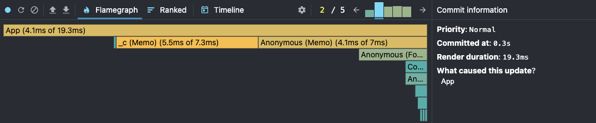
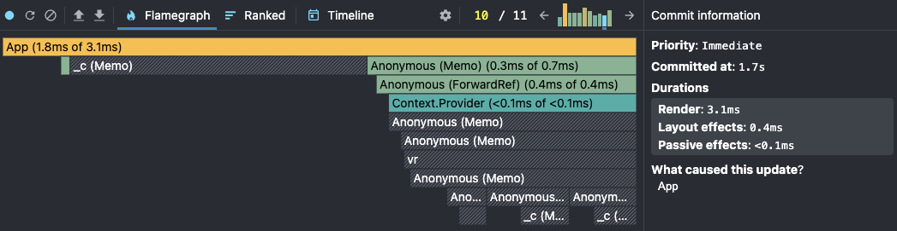
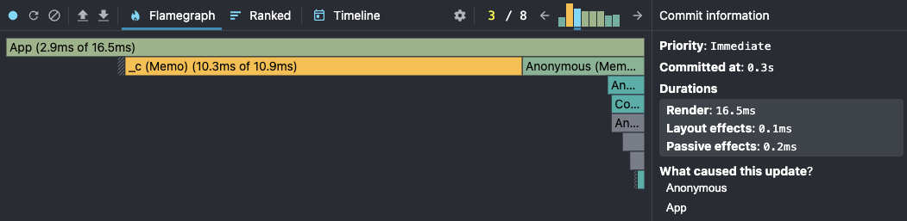
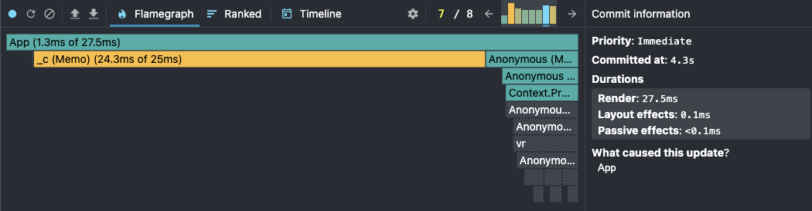
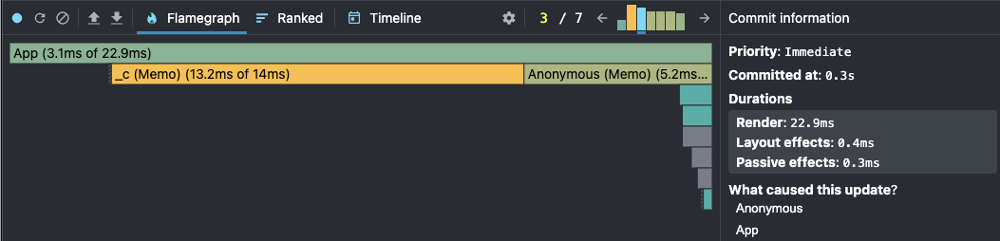
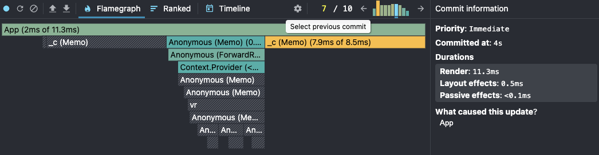
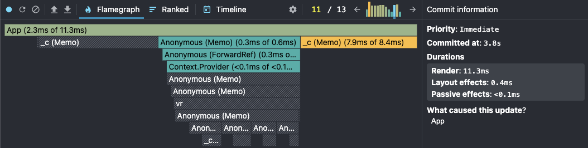
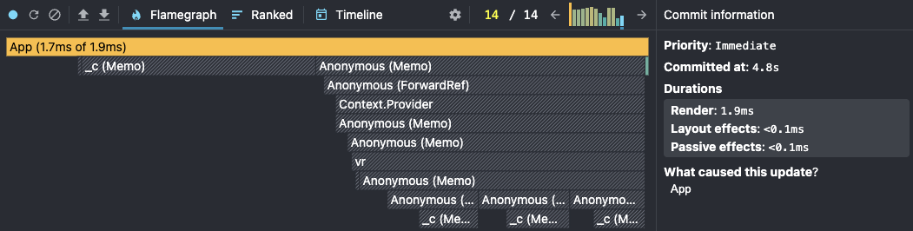

### Initial load

> Before

* YearSelector: 4.2ms
* CountryList: 29.3ms
* App 4.1ms

> After

* YearSelector: 4.2ms
* CountryList: 29.3ms
* App 4.1ms

> Comparison

Initial load is not affected by re-render optimizations — all components mount for the first time regardless of `React.memo`. Values are identical. Virtuoso adds a small one-time internal measurement pass on first render, which is absorbed into CountryList's mount time.

---

### Search

Country: Denmark, snapshot on "e"

> Before

* YearSelector: 16.6ms
* CountryList: 11ms (subtree: 66.8ms — includes ~200 CountryCard re-renders)
* App: 9.2ms
* **Total render: 93.6ms**

> After

* YearSelector: 0ms — did not render (`React.memo` + stable `useCallback`)
* CountryList: re-renders (searchQuery is its prop), Virtuoso renders only visible cards
* App: 1.8ms
* **Total render: 3.1ms**

> Comparison

| | Before | After | Δ |
|---|---|---|---|
| Total render | 93.6ms | 3.1ms | **−97% (×30)** |
| YearSelector | 16.6ms | 0ms | eliminated by `memo` |
| CountryList subtree | 66.8ms | ~7ms (visible cards only) | virtualized |

Key changes: `React.memo` on `YearSelector` eliminates its re-render entirely. `CountryList` re-renders because `searchQuery` is its prop, but `useMemo` returns the cached sort result instantly. Virtuoso renders 3–4 visible `CountryCard` components instead of 200+.

---

### Sorting

Ascending to descending

> Before

* YearSelector: 15.7ms
* CountryList: 38.9ms (self) — subtree includes ~200 CountryCard re-renders
* App: 13.5ms
* **Total render: see screenshot**

> After

* YearSelector: 0ms — did not render (`React.memo`)
* CountryList: 10.3ms (re-renders — sort params are its props), Virtuoso renders only visible cards
* App: 2.9ms
* **Total render: 16.5ms**

> Comparison

| | Before | After |
|---|---|---|
| YearSelector | 15.7ms | 0ms |
| CountryList self | 38.9ms | 10.3ms |
| Total render | see screenshot | **16.5ms** |

Key changes: `createYearDataMap` moved out of the sort comparator into `useMemo` — eliminates ~3200 unnecessary Map allocations per sort. `filteredCountries` in `useMemo` recalculates only when dependencies change. Virtuoso manages visible cards.

---

### Selecting a different year

> Before

* YearSelector: 14.2ms
* CountryList: 36.1ms
* App: 7.4ms

> After

> Comparison

See screenshot for after metrics. Key change: `YearSelector` re-renders (year is its prop — expected), but `CountryList` via Virtuoso updates only visible cards instead of all 200+.

---

### Toggling columns

> Before

#### Open modal

* YearSelector: 8.1ms
* CountryList: 29.3ms
* App: 2.1ms
* **Total render: 169ms**

#### Remove column — co2_per_capita

* YearSelector: 16.7ms
* CountryList: 39.2ms
* App: 12.5ms
* **Total render: 198.8ms**

#### Add column — cement_co2_per_capita

* YearSelector: 14.1ms
* CountryList: 36.5ms
* App: 16.3ms
* **Total render: 199.1ms**

#### Close modal

* YearSelector: 10.2ms
* CountryList: 32.7ms
* App: 3.7ms
* **Total render: 165.9ms**

---

> After

#### Open modal

* YearSelector: 0ms — did not render (`React.memo`)
* CountryList: 0ms — did not render (`React.memo` — `isColumnModalOpen` is not its prop)
* App: 1.6ms
* **Total render: 10.6ms**

#### Remove column — co2_per_capita

* YearSelector: 0ms — did not render (`React.memo`)
* CountryList + visible cards: 7.9ms
* App: 2ms
* **Total render: 11.3ms**

#### Add column — cement_co2_per_capita

* YearSelector: 0ms — did not render (`React.memo`)
* CountryList + visible cards: 7.9ms
* App: 2ms
* **Total render: ~11ms**

#### Close modal

* YearSelector: 0ms — did not render (`React.memo`)
* CountryList: 0ms — did not render (`React.memo` — `isColumnModalOpen` is not its prop)
* App: 1.7ms
* **Total render: ~3–4ms**

---

> Comparison

| Action | Before | After | Δ |
|---|---|---|---|
| Open modal | 169ms | 10.6ms | **−94%** |
| Remove column | 198.8ms | 11.3ms | **−94%** |
| Add column | 199.1ms | ~11ms | **~−94%** |
| Close modal | 165.9ms | ~3–4ms | **~−98%** |

Key changes:

- **Open / Close modal**: `CountryList` is completely excluded from the re-render cycle — `isColumnModalOpen` is not its prop, `React.memo` stops the update. Saves ~160ms on every open and close.
- **Toggle column**: `CountryList` re-renders (selectedColumns is its prop), but Virtuoso updates only 3–4 visible `CountryCard` components instead of 200+. `YearSelector` does not re-render for any of these actions.
