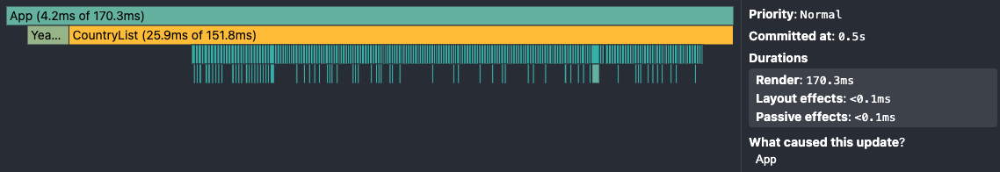
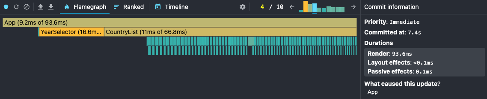
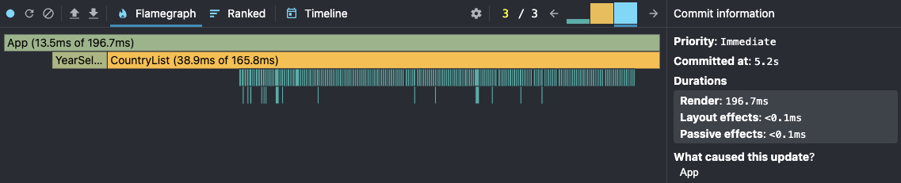
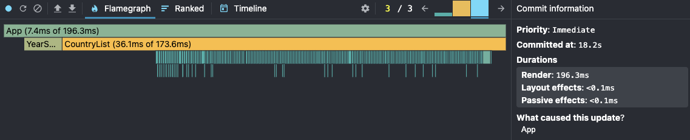
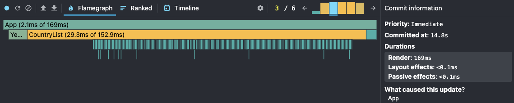
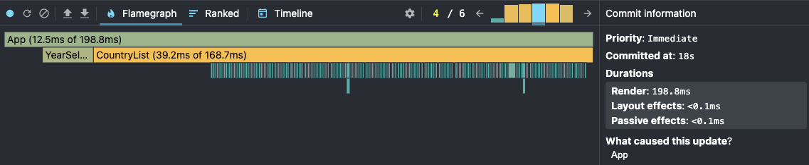
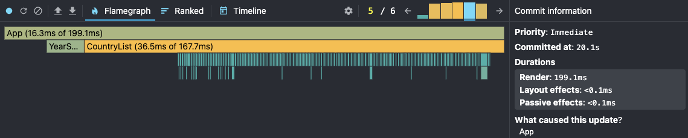
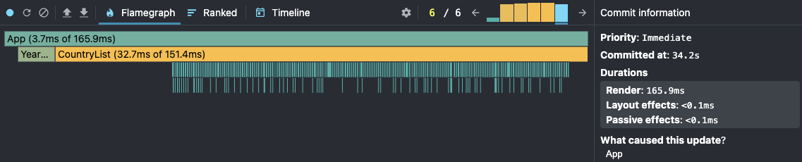

### Initial load

> Before

* YearSelector: 4.2ms
* CountryList: 29.3ms
* App 4.1ms

> After

### Search

Country: Denmark, snapshot on "e"

> Before

* YearSelector: 16.6ms
* CountryList: 11ms
* App 9.2ms

> After

### Sorting

Ascending to descending

> Before

* YearSelector: 15.7ms
* CountryList: 38.9ms
* App 13.5ms

> After

### 

### Selecting a different year

> Before

* YearSelector: 14.2ms
* CountryList: 36.1ms
* App 7.4ms

> After

### Toggling columns

> Before

#### Open modal

* YearSelector: 8.1ms
* CountryList: 29.3ms
* App 2.1ms

#### Remove column - co2_per_capita

* YearSelector: 16.7ms
* CountryList: 39.2ms
* App 12.5ms

#### Add column - cement_co2_per_capita

* YearSelector: 14.1ms
* CountryList: 36.5ms
* App 16.3ms

#### Close modal

* YearSelector: 10.2ms
* CountryList: 32.7ms
* App 3.7ms

> After
